# Gatling 2

## Introduction

We have been using Gatling 2 recently for performance evaluation. Because 
Gatling exposes a nice fluent API in comparison to JMeter and allows using 
Scala it opens a whole new variety of possibilities. Nevertheless we found that 
the model exposed by Gatling caused some confusion. The goal is not to present 
a complete picture of the Gatling 2 API (it is still in flux) but rather to 
give a better understanding of the underlying model.

## Basics

First let's create a simulation SimGet which implements the whole simulation. 
Note that all future declarations will be placed inside the primary constructor 
of SimGet:

	class SimGet extends Simulation {
	  // All future declarations will be placed here
	}

I used the built-in Python HTTP server to be load-tested. You can start it 
easily on the console invoking '$ python -mSimpleHTTPServer'. Not let's model 
a single HTTP request which is to be invoked against our started server. The 
following example  declares such a request:

	val req = http("SimGet").get("http://localhost:8000")

Let's denote this very atomic request execution with a simple red dot:

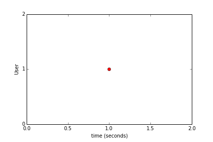

## Scenarios

The whole purpose of a load meter tool is to execute multiple requests. 
Multiple atomic requests can be executed in the context of a scenario. A 
scenario is a series of executions for one user. They can be constructed using 
the available methods in the Loops trait. For the sake of gentle introduction 
I'd like to show the following methods only:

- repeat(n times): executes a unit exactly n times (regardless of the needed 
time)
- during(t seconds): executes a unit exactly for at least t seconds 
(regardless of the amount of requests fitting in this time window)

Examples:

	val onceScn = scenario("once").exec(req)
    val timedScn = scenario("timed").during(5 seconds) { exec(req) }
    val iteratedScn = scenario("iterated").repeat(1000) { exec(req) }

The onceScn scenario fires a request exactly once. The timedScn scenario 
executes the declared request req during 5 seconds in a loop as fast as 
possible and then stops. The iteratedScn scenario executes the declared request 
exactly 1000 times and then stops. One can visualize timedScn scenario like so: 

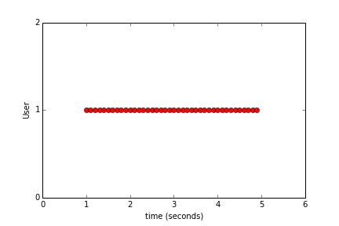

Since these scenarios are being executed in an iteration or time bounded loop 
without any delay they will measure the maximum executed requests per second 
and thus are suited for throughput measurements. The measured (successful) 
requests per second are visible as green lines in Gatling.

## Injection

Until now we considered only one user. In a multiuser scenario we have to 
inject multiple parallel users. The amount of concurrent users at a given time 
sample will be visible as yellow lines in Gatling.

### atOnce injection

The atOnce injection works like a pulse. It executes the units concurrently 
with the declared amount of users:

    val atOnceInj = atOnce(3 users)
    setUp(timedScn inject atOnceInj)

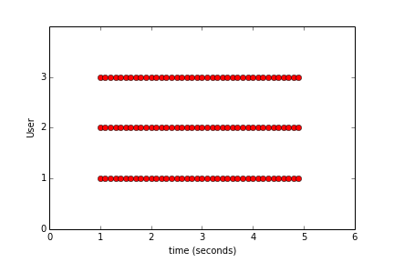

Note that starting from second 1 until second 5 we have a constant number of 
concurrently running users. The following ascii graph represents the concurrent 
users vs. time:

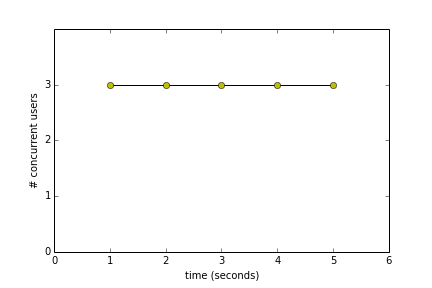

The following measurement reflects the above facts in an empirical measurement:

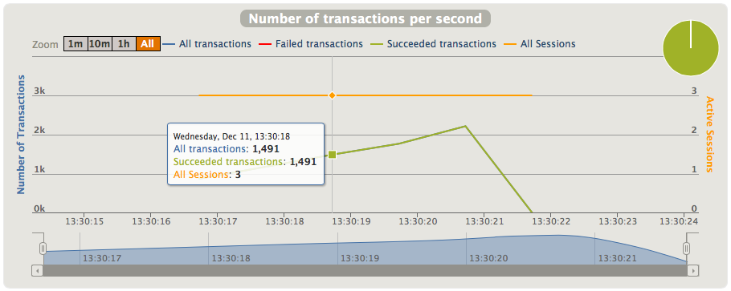

### constantRate injection

The constantRate injection works like a stretched atOnce injection over time. 
It adds n new users/sec for a given time duration. One can declare a constant 
rate of one user per second for 3 seconds as follows (resulting in 3 concurrent 
users):

    val constInj = constantRate(1 usersPerSec) during (3 seconds)
    setUp(timedScn inject constInj)

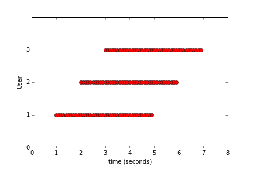

The following ascii graph represents the concurrent users vs. time:

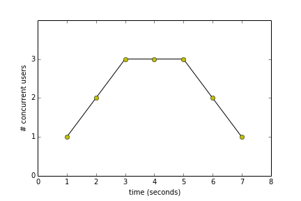

The following measurement reflects the above facts in an empirical measurement:

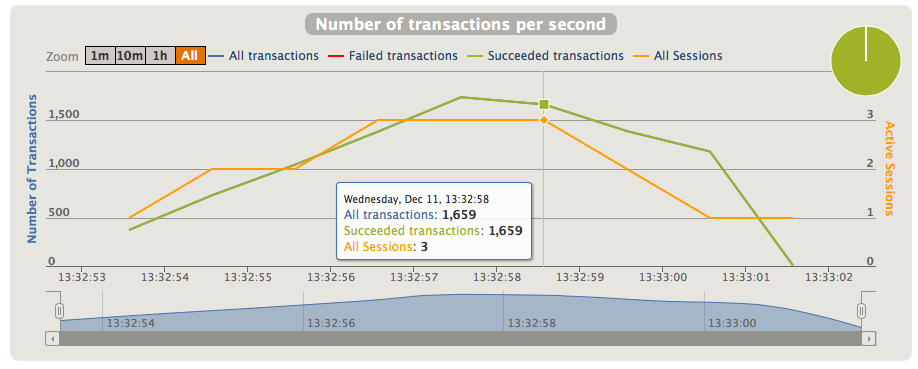

### ramp injection

The ramp injection is equivalent to constantRate injection but allows for a 
different declaration. One can define to ramp 3 users over 3 seconds (resulting 
in the same graph as constantRate) as follows:

    val rampInj = ramp(3 users) over (3 seconds)
    setUp(timedScn inject rampInj)

The following measurement reflects the above facts in an empirical measurement:

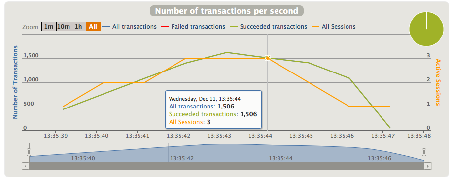

### rampRate injection

The rampRate allows a progression on the ramp injection. Starting with adding x 
users/sec it adds new users until y new users/sec over a duration. Example: If 
one starts adding 1 users/sec to 3 users/sec then at second 1 the simulation 
executes 1 concurrent user, at second 2 it adds 2 users, at second 3 it adds 3 
users resulting in a peak of 1+2+3=6 users.

	val rampRateInj = rampRate(1 usersPerSec) to (3 usersPerSec) during (3 seconds)
	setUp(timedScn inject rampRateInj)

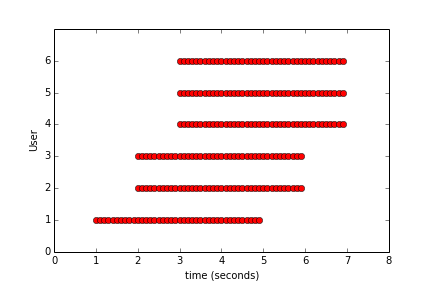

The following ascii graph represents the concurrent users vs. time:

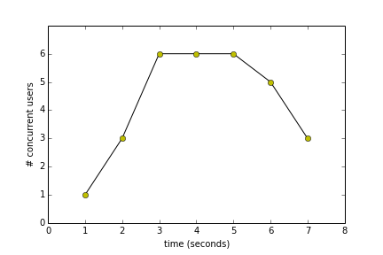

The following measurement reflects the above facts in an empirical measurement:

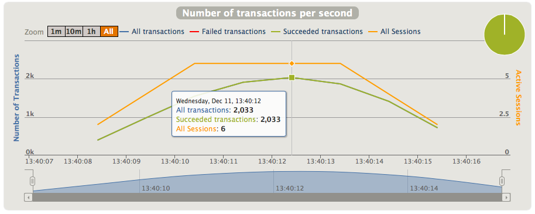

You have to be quite careful with the rampRate injection. As shown above it 
exposes a cubic growth of concurrent users if your scenarios are time-consuming 
(as our 5-second timed scenario) and expose request contention scenarios very 
quickly.

## Constant load scenarios

The above scenarios reflect measurements with requests which are supposed to 
take longer than one second or take a considerable amount of iterations. These 
scenarios are fine to measure throughput (or DoS behavior). The following table 
reveals a timed scenario with one user over 10 seconds revealing a throughput 
of ~250 requests per second: 

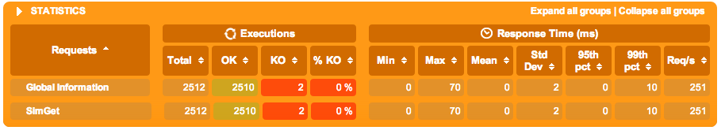

For real-world scenarios their meaning nevertheless is questionable. A rather 
more interesting scenario for i.e. a web service is as follows: How does our 
web service behave if we have a constant load of n users per second? In this 
case you'd have to: 

- Generate n new HTTP requests per second
- Execute them once
- Repeat until simulated time is over

Equipped with the API explained above this is now an easy task. First model a 
single request: 

    val onceScn = scenario("once").exec(req)

Then you have to inject users. Using the atOnceInj injection doesn't make much 
sense in constant load scenarios because they behave like pulses. A 
constantRate injection on the other hand produces a constant load on the 
server. Each second x users are injected resulting in x new requests/second:

	val onceScn = scenario("once").exec(req)
	val constInj = constantRate(3 usersPerSec) during (5 seconds)
	setUp(onceScn inject constInj)

If your web service behaves gracefully and responds within a one-second frame, 
the resulting graph looks like as follows:

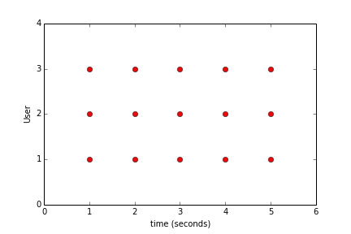

The following ascii graph represents the concurrent users vs. time:

By using this technique we would generate a load of 3 req/sec which is 
reflected in the following empirical measurements:

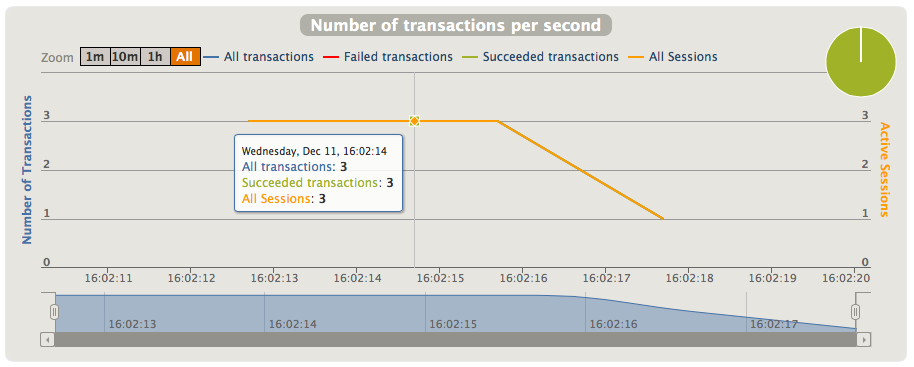

Similarly the ramp injection can be used to generate the same sort of constant 
load simulation. In this case one has to ramp 15 users over 5 seconds to 
generate a constant load of 3 requests/sec, which is reflected in the following 
measurements:

    val onceScn = scenario("once").exec(req)
    val rampInj = ramp(15 users) over (5 seconds)
    setUp(onceScn inject rampInj)

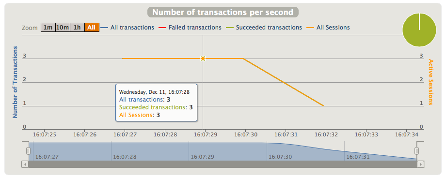

One can use the rampRate injection to ramp up the load, i.e. starting from 1 
user/sec up to 3 users/sec over 3 seconds. Afterwards you can chain an 
additional constantRate injection to create a constant load of 3 users/sec:

    val onceScn = scenario("once").exec(req)
    val rampRateInj = rampRate(1 usersPerSec) to (3 usersPerSec) during (3 seconds)
    val constInj = constantRate(3 usersPerSec) during (5 seconds)
    setUp(onceScn inject(rampRateInj, constInj))

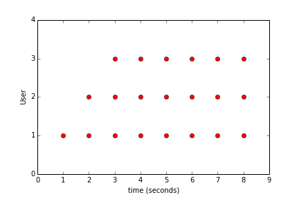

The following ascii graph represents the concurrent users vs. time:

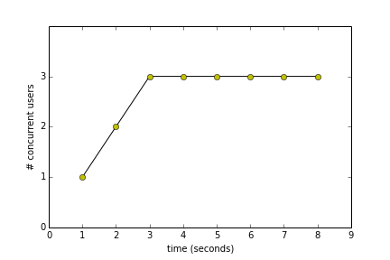

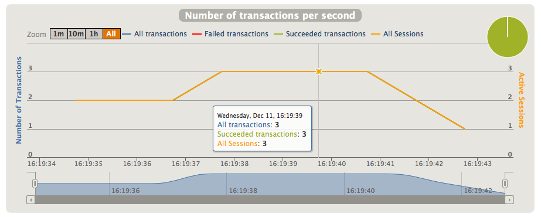

## Annex

The following simulation class was used to generate the above simulations:

	class SimGet extends Simulation {
	  // single unit
	  val req = http("SimGet").get("http://localhost:8000")
	
	  // scenarios
	  val onceScn = scenario("once").exec(req)
	  val timedScn = scenario("timed").during(5 seconds) { exec(req) }
	  val iteratedScn = scenario("iterated").repeat(1000) { exec(req) }
	
	  // injections
	  val atOnceInj = atOnce(1 users)
	  val constInj = constantRate(3 usersPerSec) during (3 seconds)
	  val rampInj = ramp(15 users) over (5 seconds)
	  val rampRateInj = rampRate(1 usersPerSec) to (3 usersPerSec) during (3 seconds)
	
	  // setup
	  setUp(onceScn inject(rampRateInj, constInj))
	}
